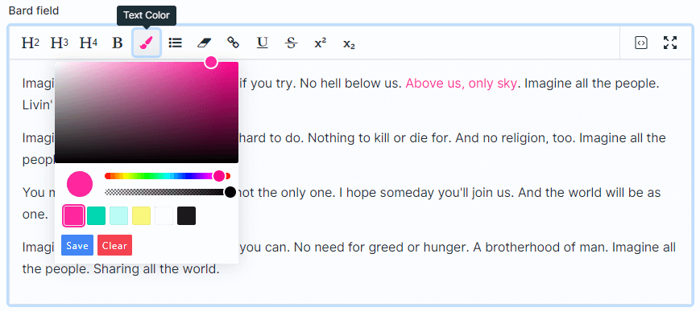
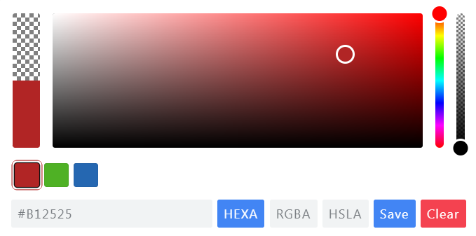

# Statamic Bard Color Plugin

We wanted to Build a nativ felt Bard Plugin for Text Colors with all features that are provided by Bard.

## Features

- Set Color for text in the Bard editor
- Moveable Button to specific position
- Usage of Build in Color Picker
- Button Color State on Cursor position
- Flexibility with publischable recommended color config

## How to Install

You can search for this addon in the `Tools > Addons` section of the Statamic control panel and click **install**, or run the following command from your project root:

``` bash
composer require nds/statamic-bard-colors
```

## How to Use

Just go into the Bard set and move the button to the position u want it to be and activate it.
Now the user can just pick a color and write or mark text where the selected color will be applied.



## Customize the Color Config

``` bash
php artisan vendor:publish --tag=statamic-bard-colors
```

Fill the recommended array with colors and that the user should get recommended.

```php
'recommended' => [
    '#B12525',
    '#4FB125',
    '#2567B1',
]
```

This configuration will than looks like this:


