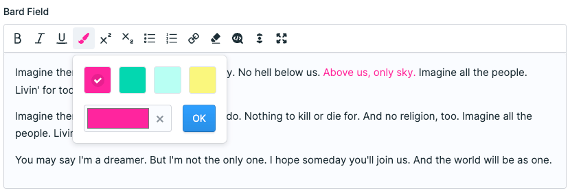

<!-- statamic:hide -->

# Statamic Bard Text Color

<!-- /statamic:hide -->

> Text color picker with swatches for Bard fields.

## Features

- Set text color in Bard fields
- Predefined color swatches
- Beautiful and easy to use color panel
- Dark Mode Support

## Installation

You can search for this addon in the `Tools > Addons` section of the Statamic control panel and click **install** or require it using Composer:

``` bash
composer require ndx/statamic-bard-color-picker
```

## How to use

Open the blueprint or fieldset that contains your Bard field, open the settings of that field and activate the text color button. 



## Configuration

If you want to define swatches or disable the color picker, make sure that the configuration file is published by entering the following command:

``` bash
php artisan vendor:publish --tag=bard-color-picker-config
```

Have a look at the [configuration file](config/bard-color-picker.php) for details.

## About us

We develop digital solutions for all kinds of disciplines. From the idea and concepts to implementation and operation.

Visit our website: [new-data-services.de](https://new-data-services.de/)

<!-- statamic:hide -->

---

<a href="https://packagist.org/packages/ndx/statamic-bard-color-picker"></a>
<a href="https://packagist.org/packages/ndx/statamic-bard-color-picker"></a>

<!-- /statamic:hide -->
